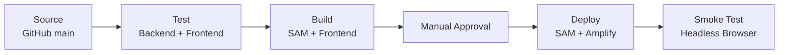
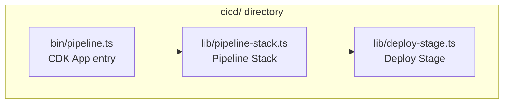

# Design Document: AWS CodePipeline CI/CD

## Overview

This design defines an AWS-native CI/CD pipeline for the slot machine application, replacing the empty GitHub Actions placeholder. The pipeline is provisioned as a CDK application in the `cicd/` directory using the `aws-cdk-lib/pipelines` module (CDK Pipelines). It automates the full lifecycle: source checkout from GitHub, unit testing, artifact building, manual approval, deployment of both the SAM backend and Amplify-hosted frontend, and post-deployment smoke testing with a headless browser.

The pipeline targets `eu-west-1` and uses a CodeStar Connection for GitHub integration. It follows a linear stage progression where any failure halts the pipeline.



## Architecture

### High-Level Structure

The CDK application defines a single stack (`SlotMachinePipelineStack`) that synthesizes a CodePipeline with six sequential stages. The pipeline is self-mutating — changes to the `cicd/` directory trigger the pipeline to update itself before proceeding.



### CDK Project Layout

```
cicd/
├── bin/
│   └── pipeline.ts            # CDK app entry point
├── lib/
│   ├── pipeline-stack.ts      # Pipeline stack definition
│   └── deploy-stage.ts        # Deployment stage construct
├── cdk.json                   # CDK configuration
├── package.json               # Dependencies
└── tsconfig.json              # TypeScript strict config
```

### Pipeline Stages Detail

| Stage | Action Type | CodeBuild Runtime | Key Operations |
|-------|-------------|------------------|----------------|
| Source | CodeStarConnection | — | Checkout `main` branch |
| Test | CodeBuildStep | Node.js 22 | `npm ci` + run tests with JUnit reporters |
| Build | CodeBuildStep | Node.js 22, SAM CLI | `sam build` + esbuild frontend |
| Approval | ManualApprovalStep | — | Human gate |
| Deploy | ShellStep + SDK calls | Node.js 22, SAM CLI, AWS CLI | `sam deploy` + Amplify deployment |
| Smoke Test | CodeBuildStep | Node.js 22, Chromium | Puppeteer-based headless browser test |

## Components and Interfaces

### 1. Pipeline Stack (`SlotMachinePipelineStack`)

The main CDK stack containing:

- **CodeStarConnection**: GitHub authentication resource
- **CodePipeline**: Built with `pipelines.CodePipeline` using `CodePipelineSource.connection()`
- **Test Step**: `pipelines.CodeBuildStep` running unit tests
- **Build Step**: `pipelines.CodeBuildStep` producing SAM and frontend artifacts
- **Deploy Stage**: Custom `cdk.Stage` added via `pipeline.addStage()` with pre/post steps
- **Smoke Test Step**: `pipelines.CodeBuildStep` as a post-deployment step

### 2. Source Configuration

```typescript
const source = CodePipelineSource.connection('owner/repo', 'main', {
  connectionArn: connection.connectionArn,
  triggerOnPush: true,
});
```

The CodeStar Connection is defined as a `CfnConnection` resource. After initial deployment, the connection must be manually set to AVAILABLE status via the AWS Console (one-time GitHub OAuth handshake).

### 3. Test Step

A `CodeBuildStep` that:
1. Installs dependencies for `backend/draw-lambda/` and `backend/seed-lambda/` (each has its own `package.json`)
2. Installs dependencies for `frontend/`
3. Runs backend tests: `node --test --test-reporter=junit --test-reporter-destination=backend-results.xml`
4. Runs frontend tests: `npx vitest run --reporter=junit --outputFile=frontend-results.xml`
5. Publishes JUnit reports via CodeBuild report groups

### 4. Build Step

A `CodeBuildStep` that:
1. Runs `sam build` in the `backend/` directory
2. Queries CloudFormation for stack outputs using the `samStackName` context parameter (IdentityPoolId, SlotFunctionName, region)
3. Performs sed/envsubst replacement of `{{AWS_REGION}}`, `{{IDENTITY_POOL_ID}}`, `{{SLOT_FUNCTION_NAME}}` placeholders in `frontend/src/app.js`
4. Runs esbuild to produce `static/app.bundle.js`
5. Packages `frontend/static/` (excluding `index-local.html`) into a zip
6. Outputs both the SAM `.aws-sam/build/` directory and the frontend zip as artifacts

The CloudFormation query uses the parameterized stack name:
```bash
aws cloudformation describe-stacks --stack-name "$SAM_STACK_NAME" --query 'Stacks[0].Outputs'
```
where `SAM_STACK_NAME` is injected as an environment variable from the CDK context parameter.

### 5. Deploy Step

Split into two sequential actions:

**Backend Deploy:**
- Runs `sam deploy --stack-name "$SAM_STACK_NAME" --config-file backend/samconfig.toml --no-confirm-changeset --no-fail-on-empty-changeset`
- Uses IAM capabilities: `CAPABILITY_IAM CAPABILITY_NAMED_IAM`
- Region: `eu-west-1`
- `SAM_STACK_NAME` is injected as an environment variable from the CDK context parameter

**Frontend Deploy:**
- Extracts Amplify App ID from the CloudFormation stack output `AmplifyDefaultUrl` (queried using `samStackName`)
- Calls `aws amplify create-deployment` to get upload URL and job ID
- Uploads the frontend zip to the pre-signed URL
- Calls `aws amplify start-deployment` with the job ID
- Deploys to branch `main`

### 6. Smoke Test Step

A `CodeBuildStep` using a custom Docker image or managed image with Chromium:
1. Retrieves `AmplifyDefaultUrl` from CloudFormation outputs using the `samStackName` parameter
2. Launches Puppeteer with headless Chromium
3. Navigates to the Amplify URL
4. Waits up to 10 seconds for `#slot_handle` to be visible
5. Simulates `mousedown` + `mouseup` on `#slot_handle`
6. Polls up to 15 seconds until all three slot images (`#slot_L`, `#slot_M`, `#slot_R`) have a `src` attribute that doesn't contain `slotpullanimation.gif` and isn't empty
7. Total step timeout: 60 seconds

### 7. IAM Roles

Each CodeBuild project gets a dedicated IAM role:

| Role | Permissions |
|------|-------------|
| Test Role | S3 (artifact bucket), CodeBuild reports, CloudWatch Logs |
| Build Role | S3 (artifacts), CloudFormation DescribeStacks, CloudWatch Logs |
| Deploy Role | CloudFormation (full stack management), Lambda, DynamoDB, Cognito, IAM (create/pass roles per SAM template), Amplify (create-deployment, start-deployment), S3, CloudWatch Logs |
| Smoke Test Role | CloudFormation DescribeStacks, Amplify GetApp (read-only), CloudWatch Logs |

**Least-privilege design decisions:**
- No wildcard resource ARNs for Lambda invoke, DynamoDB, or Cognito permissions
- Deploy role scoped to the stack name specified by the `samStackName` CDK context parameter and its resource ARN patterns
- Smoke test role has read-only Amplify access

## Data Models

### Pipeline Artifacts

| Artifact | Contents | Produced By | Consumed By |
|----------|----------|-------------|-------------|
| Source | Full repository at HEAD of `main` | Source stage | Test, Build |
| SAM Build | `.aws-sam/build/` directory | Build stage | Deploy (backend) |
| Frontend Zip | `static/` contents minus `index-local.html` | Build stage | Deploy (frontend) |

### CloudFormation Stack Outputs (consumed by pipeline)

| Output Key | Usage |
|------------|-------|
| `IdentityPoolId` | Injected into frontend build |
| `SlotFunctionName` | Injected into frontend build |
| `AmplifyDefaultUrl` | Frontend deploy target + smoke test URL |
| `SlotTableName` | Not used by pipeline |

### CDK Context / Configuration

The SAM backend stack name is provided as a CDK context parameter (`samStackName`), allowing the pipeline to target different stacks without code changes. All pipeline steps that interact with CloudFormation (Build, Deploy, Smoke Test) resolve the stack name from this parameter.

```json
// cdk.json
{
  "app": "npx ts-node bin/pipeline.ts",
  "context": {
    "@aws-cdk/core:newStyleStackSynthesis": true,
    "samStackName": "slot-machine-stack"
  }
}
```

The `samStackName` context value is read in `pipeline-stack.ts`:

```typescript
const samStackName = this.node.tryGetContext('samStackName');
if (!samStackName) {
  throw new Error('CDK context variable "samStackName" is required');
}
```

It can be overridden at synthesis time:

```bash
cdk synth -c samStackName=my-custom-stack
```

## Error Handling

### Stage Failure Propagation

- **Test failure**: CodeBuild exit code > 0 → pipeline stage FAILED → no further stages execute
- **Build failure**: SAM build or esbuild failure → stage FAILED → pipeline halts
- **Approval timeout/rejection**: Pipeline marked FAILED
- **Deploy failure**: SAM deploy or Amplify API error → stage FAILED → pipeline halts
- **Smoke test failure**: Puppeteer timeout or assertion failure → exit code 1 → stage FAILED

### Specific Error Scenarios

| Scenario | Behavior |
|----------|----------|
| CodeStar Connection not AVAILABLE | Pipeline doesn't trigger; connection status visible in console |
| npm install failure | Test/Build step fails with non-zero exit code |
| SAM deploy changeset failure | `sam deploy` returns non-zero; stage fails |
| Amplify deployment API error | AWS CLI returns non-zero; stage fails |
| Smoke test page timeout (>10s) | Puppeteer throws TimeoutError; script exits 1 |
| Smoke test slot timeout (>15s) | Polling loop exits; script exits 1 |
| Smoke test total timeout (>60s) | CodeBuild timeout terminates the build |

### Retry and Recovery

- Pipeline executions are not automatically retried on failure
- Failed stages can be retried manually from the CodePipeline console
- SAM deploy uses `--no-fail-on-empty-changeset` to avoid failing when there are no infrastructure changes

## Testing Strategy

### Approach

This feature is primarily Infrastructure as Code (CDK). The testing strategy follows the IaC testing pyramid:

1. **CDK Snapshot Tests** — Verify synthesized CloudFormation template structure
2. **CDK Fine-Grained Assertions** — Verify specific resource properties and configurations
3. **Integration Validation** — `cdk synth` succeeds and produces valid templates

### CDK Unit Tests (TypeScript, Jest)

Tests verify that the synthesized CloudFormation template contains the expected resources:

- Pipeline resource exists with correct stage count
- CodeStar Connection resource with correct provider type
- CodeBuild projects with correct environment (Node.js 22 runtime image)
- IAM roles with appropriate policy statements (no wildcard resources for Lambda/DynamoDB/Cognito)
- CloudWatch Logs log groups with 30-day retention
- Manual approval action exists in the correct stage position
- Build step produces expected output artifacts

### Smoke Test Script Unit Tests (Vitest or Node test runner)

The Puppeteer-based smoke test script contains testable logic:
- Polling logic (retry with timeout)
- URL extraction from CloudFormation output
- Assertion conditions (src attribute checks)

These can be unit tested with mocked Puppeteer/page objects.

### Validation Approach

- Run `cdk synth` as a CI gate to ensure templates are valid
- Use `cdk diff` in development to preview infrastructure changes
- CDK snapshot tests catch unintended template drift

### Test Commands

```bash
# From cicd/ directory
npm test              # Jest tests for CDK assertions
cdk synth             # Validate synthesis
```
