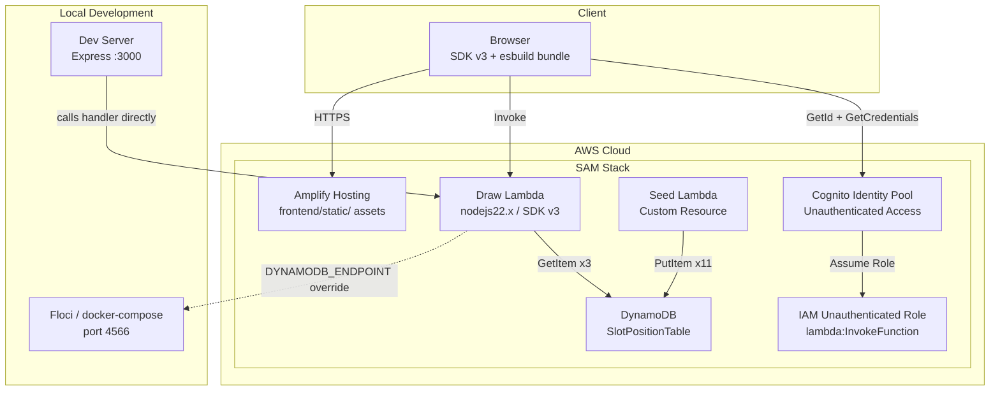

# Design Document

## Overview

This design modernizes the slot machine application's AWS infrastructure from a legacy SAM template (nodejs14.x, SDK v2, S3 static hosting) to a current-generation SAM template using nodejs22.x, AWS SDK v3, Amplify Hosting, and automated DynamoDB seed data via a custom resource. The solution retains SAM as the infrastructure-as-code tool but replaces deprecated patterns with modern equivalents.

### Key Architectural Decisions

1. **SAM over CDK**: The project stays with SAM (`template.yaml`) rather than migrating to CDK. SAM is simpler for this single-stack serverless application and keeps the infrastructure declarative in a single file.

2. **Amplify Hosting over S3 static hosting**: Replaces the S3 bucket + bucket policy pattern with Amplify Hosting, which provides HTTPS, custom domain support, and simplified deployment without managing CloudFront or bucket policies.

3. **Custom Resource for seed data**: A CloudFormation custom resource backed by a Lambda function populates DynamoDB during deployment, eliminating the need for manual data loading.

4. **Floci-based local development**: Uses `docker-compose.yml` with Floci (local AWS emulator) and a dev server that invokes the Lambda handler directly, enabling offline development without AWS credentials.

5. **OIDC-based CI/CD**: GitHub Actions pipeline uses OIDC federation for AWS credential assumption rather than long-lived access keys.

6. **Monorepo structure**: Project split into `backend/` (SAM), `frontend/` (browser app), and `local/` (dev tooling) for clear separation of concerns.

7. **Shared seed logic**: Seed data and write logic extracted into `seed-records.js` module, reused by both the CloudFormation custom resource Lambda and the local seed script.

## Architecture



### Request Flow

1. Browser loads static assets from Amplify Hosting default URL (or custom domain)
2. Frontend obtains temporary credentials from Cognito Identity Pool using `GetId` + `GetCredentialsForIdentity` (unauthenticated flow)
3. Frontend invokes Draw Lambda via AWS SDK v3 using temporary credentials
4. Lambda reads 3 random slot positions (0–10) from DynamoDB
5. Lambda returns image filenames and winner status to the frontend

## Components and Interfaces

### 1. SAM Template (`backend/template.yaml`)

**Responsibility**: Declares all AWS resources for the stack.

**Resources defined**:
| Resource | Type | Purpose |
|----------|------|---------|
| SlotPositionTable | AWS::DynamoDB::Table | Stores slot position → image mappings |
| SlotPositionFunction | AWS::Serverless::Function | Reads random positions, determines winner |
| SeedDataFunction | AWS::Serverless::Function | Custom resource handler to seed DynamoDB |
| SeedDataCustomResource | AWS::CloudFormation::CustomResource | Triggers seed on deploy |
| SlotPositionCognitoIdentityPool | AWS::Cognito::IdentityPool | Provides unauthenticated credentials |
| LambdaInvocationRole | AWS::IAM::Role | Allows unauthenticated users to invoke Lambda |
| IdentityPoolRoleMapping | AWS::Cognito::IdentityPoolRoleAttachment | Maps role to identity pool |
| SlotMachineAmplifyApp | AWS::Amplify::App | Hosts static frontend |
| AmplifyBranch | AWS::Amplify::Branch | Main branch for deployment |
| AmplifyDomain | AWS::Amplify::Domain | Custom domain (conditional) |

**Parameters**:
- `CustomDomain` (String, default: ""): Optional custom domain for Amplify app

**Outputs**:
- `IdentityPoolId`: Cognito Identity Pool ID
- `SlotFunctionName`: Lambda function name
- `AmplifyDefaultUrl`: Amplify app default URL
- `SlotTableName`: DynamoDB table name

### 2. Draw Lambda (`backend/draw-lambda/app.js`)

**Responsibility**: Reads 3 random slot positions from DynamoDB, determines if all match (winner).

**Interface**:
```javascript
// Input: Lambda event (unused)
// Output: { isWinner: boolean, leftWheelImage, middleWheelImage, rightWheelImage }

export const handler = async (event) => {
  // Uses TABLE_NAME env var
  // Uses optional DYNAMODB_ENDPOINT env var for local development
  // Returns slot results with winner determination
};
```

**Dependencies**:
- `@aws-sdk/client-dynamodb` (SDK v3)
- Environment variables: `TABLE_NAME` (required), `DYNAMODB_ENDPOINT` (optional)

**Error handling**:
- If `TABLE_NAME` is not set → throws error with descriptive message
- If DynamoDB is unreachable → returns error response indicating data retrieval failure

### 3. Seed Lambda (`backend/seed-lambda/`)

**Responsibility**: CloudFormation custom resource handler that writes 11 slot position records to DynamoDB on stack creation/update.

**Files**:
- `index.js` — Lambda handler (CloudFormation custom resource protocol)
- `seed-records.js` — Shared module exporting `SLOT_DATA` array and `writeSeedRecords()` function

**Interface**:
```javascript
// Input: CloudFormation custom resource event (Create/Update/Delete)
// Output: Sends SUCCESS/FAILED to CloudFormation response URL

export const handler = async (event) => {
  // On Create/Update: calls writeSeedRecords() to write 11 records
  // On Delete: no-op (table deletion handles cleanup)
  // Reports SUCCESS/FAILED to CloudFormation
};
```

**Dependencies**:
- `@aws-sdk/client-dynamodb` (SDK v3)
- Environment variable: `TABLE_NAME`

**Seed data** (11 records):
| slotPosition | imageFile |
|---|---|
| 0 | spad_a.png |
| 1 | spad_k.png |
| 2 | spad_q.png |
| 3 | spad_j.png |
| 4 | hart_a.png |
| 5 | hart_k.png |
| 6 | hart_q.png |
| 7 | hart_j.png |
| 8 | diam_a.png |
| 9 | diam_k.png |
| 10 | diam_q.png |

### 4. Frontend Build (`frontend/`)

**Responsibility**: Bundles AWS SDK v3 client code for the browser using esbuild.

**Source**: `frontend/src/app.js`

**Dependencies**:
- `@aws-sdk/client-lambda` — Lambda invocation
- `@aws-sdk/client-cognito-identity` — Cognito Identity Pool credentials (GetId + GetCredentialsForIdentity)
- `esbuild` — JavaScript bundler (dev dependency)

**Build output**: `frontend/static/app.bundle.js` (single minified IIFE bundle targeting ES2020)

**Placeholders** (replaced at deploy time by `frontend/deploy.ps1`):
- `{{AWS_REGION}}` — AWS region
- `{{IDENTITY_POOL_ID}}` — Cognito Identity Pool ID
- `{{SLOT_FUNCTION_NAME}}` — Lambda function name

**Build command**: `npx esbuild src/app.js --bundle --minify --outfile=static/app.bundle.js --format=iife --platform=browser --target=es2020`

### 5. Frontend Deployment Script (`frontend/deploy.ps1`)

**Responsibility**: Automates frontend build and deployment to Amplify Hosting.

**Steps**:
1. Reads CloudFormation stack outputs (Identity Pool ID, Lambda name, Amplify App ID)
2. Copies frontend source, replaces placeholders with stack values
3. Bundles with esbuild
4. Packages static assets into a zip
5. Creates Amplify deployment and uploads zip
6. Starts the Amplify deployment job

### 6. Local Development (`local/`)

**Responsibility**: Runs the full application locally using Floci as an AWS emulator.

**Files**:
- `docker-compose.yml` — Runs Floci on port 4566
- `seed-local.js` — Creates table and seeds data (reuses `backend/seed-lambda/seed-records.js`)
- `dev-server.js` — Express server on port 3000 that serves frontend and invokes the Lambda handler directly

```yaml
# local/docker-compose.yml
services:
  floci:
    image: floci/floci:latest
    ports:
      - "4566:4566"
    volumes:
      - ./data:/app/data
```

### 7. GitHub Actions Workflow (`.github/workflows/deploy.yml`)

**Responsibility**: Placeholder CI/CD pipeline for automated deployment.

**Triggers**: Push to `main` branch

**Steps**:
1. Checkout code
2. Configure AWS credentials via OIDC
3. `sam build`
4. `sam deploy`

### 8. SAM Config (`backend/samconfig.toml`)

**Responsibility**: Stores default SAM CLI deployment parameters.

```toml
[default.deploy.parameters]
stack_name = "slot-machine-stack"
region = "eu-west-1"
resolve_s3 = true
capabilities = "CAPABILITY_IAM CAPABILITY_NAMED_IAM"
parameter_overrides = "CustomDomain="
```

## Data Models

### DynamoDB Table: SlotPositionTable

| Attribute | Type | Role |
|-----------|------|------|
| slotPosition | Number (N) | Partition Key |
| imageFile | String (S) | Card image filename |

**Billing mode**: PAY_PER_REQUEST (on-demand)
**Deletion policy**: Delete (removed with stack)

### Lambda Response Model

```typescript
interface SlotResult {
  isWinner: boolean;
  leftWheelImage: { file: { S: string } };
  middleWheelImage: { file: { S: string } };
  rightWheelImage: { file: { S: string } };
}
```

The response structure preserves backward compatibility with the existing frontend's `displayPull()` function, which expects `pullResults.leftWheelImage.file.S` format.

### CloudFormation Custom Resource Event

```typescript
interface CustomResourceEvent {
  RequestType: 'Create' | 'Update' | 'Delete';
  ResponseURL: string;
  StackId: string;
  RequestId: string;
  ResourceType: string;
  LogicalResourceId: string;
  ResourceProperties: Record<string, string>;
}
```

### Seed Data Definition

The seed data is defined in a shared module (`backend/seed-lambda/seed-records.js`):

```javascript
export const SLOT_DATA = [
  { slotPosition: 0, imageFile: 'spad_a.png' },
  { slotPosition: 1, imageFile: 'spad_k.png' },
  // ... 11 records total
  { slotPosition: 10, imageFile: 'diam_q.png' },
];

export async function writeSeedRecords(client, tableName) {
  // Writes all records, returns count
}
```

## Correctness Properties

### Property 1: Winner determination is correct

*For any* three slot image values (left, middle, right), the `isWinner` field in the Lambda response SHALL be `true` if and only if all three image values are identical strings.

**Validates: Requirements 4.8, 9.4**

### Property 2: Seed data records satisfy schema constraints

*For any* record in the seed data array, the `slotPosition` value SHALL be an integer in the range [0, 10] and the `imageFile` value SHALL be a non-empty string with length ≤ 50 characters matching the pattern `{suit}_{rank}.png`.

**Validates: Requirements 3.1, 3.3**

### Property 3: DynamoDB client endpoint configuration

*For any* valid URL string set as the `DYNAMODB_ENDPOINT` environment variable, the DynamoDB client SHALL be constructed with that URL as its endpoint. When the variable is absent or empty, the client SHALL use the default AWS endpoint.

**Validates: Requirements 8.7**

## Error Handling

### Draw Lambda (`backend/draw-lambda/app.js`)

| Condition | Behavior |
|-----------|----------|
| `TABLE_NAME` env var not set | Throw error: "Required TABLE_NAME configuration is missing" |
| DynamoDB GetItem fails (network/throttle) | Return error response: `{ error: "Could not retrieve slot data" }` |
| Random position returns no item | Treated as DynamoDB error (should not occur with seeded data) |

### Seed Lambda (`backend/seed-lambda/index.js`)

| Condition | Behavior |
|-----------|----------|
| `TABLE_NAME` env var not set | Report FAILED to CloudFormation with descriptive message |
| Individual record write fails | Report FAILED with message indicating which position failed |
| No records written successfully | Report FAILED indicating no records were written |
| Delete request type | No-op, report SUCCESS (table deletion handles cleanup) |
| All records written | Report SUCCESS to CloudFormation |

### CloudFormation Custom Resource Response

The seed Lambda uses the standard CloudFormation custom resource response protocol:
- Sends HTTP PUT to `event.ResponseURL` with status, reason, and physical resource ID
- On failure, CloudFormation rolls back the stack
- Uses `https` module (Node.js built-in) for the response — no external dependencies needed

## Testing Strategy

### Unit Tests

Unit tests verify specific examples and edge cases using a standard test framework.

**Framework**: Node.js built-in test runner (`node:test`) with `node:assert`

**Draw Lambda unit tests**:
- Handler returns correct response structure with valid slot data
- Handler throws when TABLE_NAME is not set
- Handler returns error response when DynamoDB is unreachable
- Winner detection: three identical images → `isWinner: true`
- Non-winner: at least one different image → `isWinner: false`

**Seed Lambda unit tests**:
- On Create event: writes all 11 records to DynamoDB
- On Delete event: sends SUCCESS without writing
- On write failure: sends FAILED with position-specific error
- On zero successful writes: sends FAILED with "no records written" message

### Property-Based Tests

Property-based tests verify universal correctness properties across randomized inputs.

**Framework**: [fast-check](https://github.com/dubzzz/fast-check) (JavaScript PBT library)

**Configuration**: Minimum 100 iterations per property test

**Tests**:

1. **Property 1: Winner determination is correct**
   - Generate 3 arbitrary image filename strings
   - Call winner determination logic
   - Assert: result is `true` iff all three strings are equal

2. **Property 2: Seed data records satisfy schema constraints**
   - For each record in SLOT_DATA array
   - Assert: slotPosition is integer in [0, 10], imageFile is non-empty string ≤ 50 chars matching `{suit}_{rank}.png`

3. **Property 3: DynamoDB client endpoint configuration**
   - Generate arbitrary valid URL strings
   - Construct DynamoDB client with DYNAMODB_ENDPOINT set to that URL
   - Assert: client is configured with the generated endpoint

### Integration Tests

Integration tests verify real AWS service interactions (run against Floci):
- Seed script creates table and populates 11 records
- Lambda handler reads from Floci DynamoDB and returns valid response
- Overwrite behavior: re-seeding overwrites existing records

### Smoke Tests

Smoke tests verify infrastructure configuration (run after `sam build` or template validation):
- `sam validate` passes on `backend/template.yaml`
- Template contains all required resources
- Template outputs include all required keys
- GitHub Actions workflow file has correct structure
