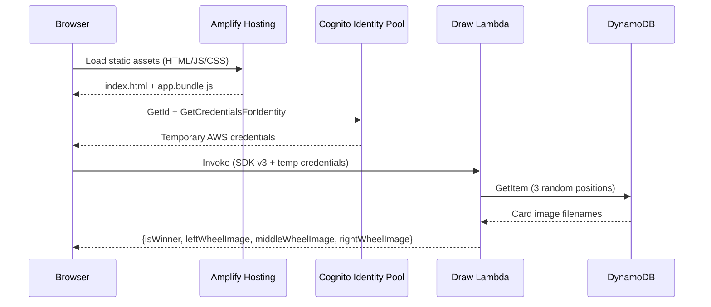
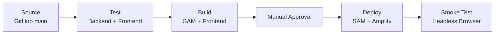

# Slot Machine 🎰

A demo application showcasing AWS serverless capabilities. Pull the handle and see if three cards match — all running on fully managed AWS services with zero servers to maintain.

**Live demo:** https://demo-slotmachine.sircloud.pl/

<p align="center">
  
</p>

## What This Demonstrates

This project is a reference implementation for building a serverless web application on AWS using modern tooling:

- **Compute without servers** — Lambda functions handle business logic on demand
- **NoSQL at scale** — DynamoDB stores data with single-digit millisecond reads
- **Zero-trust frontend auth** — Cognito provides temporary credentials without user sign-up
- **Static hosting done right** — Amplify Hosting serves assets over HTTPS with custom domains
- **Infrastructure as Code** — SAM template defines the entire stack declaratively
- **Local development** — Floci emulates AWS services locally for fast iteration

## Architecture



The frontend obtains temporary AWS credentials from Cognito (no sign-in required), invokes the Lambda function directly using AWS SDK v3, and displays the result. The Lambda reads 3 random positions from DynamoDB and determines if all three cards match (winner).

## Project Structure

```
├── backend/                      # AWS SAM infrastructure
│   ├── draw-lambda/              # Slot draw Lambda (nodejs22.x, SDK v3)
│   ├── seed-lambda/              # Seed data Lambda (CloudFormation custom resource)
│   │   ├── index.js             # Lambda handler
│   │   └── seed-records.js     # Shared seed data + write logic
│   ├── template.yaml            # SAM template
│   └── samconfig.toml            # SAM CLI config
├── frontend/                     # Browser app
│   ├── src/                      # JS source (SDK v3, esbuild)
│   ├── static/                   # HTML, CSS, images
│   └── deploy.ps1               # Build + deploy to Amplify
├── cicd/                         # CDK pipeline (CodePipeline V2)
│   ├── lib/                      # Stack, stages, and step definitions
│   ├── scripts/                  # Shell scripts for each pipeline step
│   └── cdk.json                  # Pipeline configuration
├── local/                        # Local development
│   ├── dev-server.js             # Express dev server
│   ├── seed-local.js             # Seeds local DynamoDB (reuses seed-records.js)
│   └── docker-compose.yml        # Floci (local AWS emulator)
├── package.json                  # Root scripts
└── README.md
```

## Prerequisites

- [Docker](https://docs.docker.com/get-docker/) (with Docker Compose)
- [Node.js 22.x](https://nodejs.org/)
- [AWS SAM CLI](https://docs.aws.amazon.com/serverless-application-model/latest/developerguide/install-sam-cli.html)

## Local Development

Uses [Floci](https://github.com/floci-io/floci) — a free, open-source AWS emulator.

```bash
# Start Floci
docker compose -f local/docker-compose.yml up -d

# Install dependencies
npm install
cd frontend; npm install; cd ..

# Seed local DynamoDB
npm run seed-local

# Start dev server
npm run dev
```

Open http://localhost:3000

The dev server calls the Lambda handler function directly (no container overhead). DynamoDB operations go through Floci's emulated DynamoDB on port 4566.

### View Floci Logs

```bash
docker compose -f local/docker-compose.yml logs -f floci
```

### Stop

```bash
docker compose -f local/docker-compose.yml down
```

## Deployment

### Backend (SAM)

```bash
npm run deploy-backend
```

With custom domain:

```bash
cd backend
sam build
sam deploy --parameter-overrides "CustomDomain=your-domain.com"
```

Stack name and region are configured in `backend/samconfig.toml`:

```toml
[default.deploy.parameters]
stack_name = "slot-machine-stack"
region = "eu-west-1"
```

### Frontend (Amplify)

```bash
npm run deploy-frontend
```

Reads stack outputs, builds the SDK v3 bundle with esbuild, and deploys to Amplify Hosting.

### Destroy

```bash
cd backend
sam delete --region eu-west-1
```

## CI/CD Pipeline

The project uses AWS CodePipeline (V2) provisioned via CDK for fully automated deployments. The pipeline triggers on pushes to `main` that modify files in `backend/`, `frontend/`, or `cicd/`.



### Pipeline Stages

| Stage | What it does |
|-------|-------------|
| **Source** | Checks out the repo via CodeStar Connection (GitHub) |
| **Synth** | Runs `cdk synth` to produce the pipeline's own CloudFormation template (self-mutating) |
| **Test** | Installs deps and runs backend unit tests (Node test runner + JUnit) and frontend tests (Vitest + JUnit) |
| **Build** | Runs `sam build`, injects stack outputs into frontend, bundles with esbuild, packages zip |
| **Manual Approval** | Pauses for human approval before deploying to production |
| **Backend Deploy** | Runs `sam deploy` against the SAM stack |
| **Frontend Deploy** | Queries stack outputs, replaces config placeholders, bundles, uploads zip to Amplify Hosting |
| **Smoke Test** | Launches headless Chromium via Puppeteer, pulls the slot handle, verifies slot images resolve |

### Pipeline Configuration

The CDK pipeline is in `cicd/` and parameterized via `cdk.json` context:

```json
{
  "samStackName": "slot-machine-stack",
  "deployRegion": "eu-west-1",
  "customDomain": "demo-slotmachine.sircloud.pl"
}
```

Override at synth time: `cdk synth -c deployRegion=us-east-1 -c customDomain=other.example.com`

### Pipeline Structure

```
cicd/
├── bin/pipeline.ts               # CDK app entry point
├── lib/
│   ├── pipeline-stack.ts         # Pipeline orchestration
│   ├── deploy-stage.ts           # Deploy stage construct
│   └── steps/                    # One file per pipeline step + IAM permissions
│       ├── test-step.ts
│       ├── build-step.ts
│       ├── backend-deploy-step.ts
│       ├── frontend-deploy-step.ts
│       └── smoke-test-step.ts
├── scripts/                      # Shell scripts executed by CodeBuild
│   ├── test.sh
│   ├── build.sh
│   ├── deploy-backend.sh
│   ├── deploy-frontend.sh
│   ├── smoke-test.sh
│   └── smoke-test.js             # Puppeteer smoke test logic
├── cdk.json
├── package.json
└── tsconfig.json
```

### First-Time Setup

1. Deploy the pipeline: `cd cicd && npx cdk deploy`
2. Complete the GitHub OAuth handshake in the AWS Console (Developer Tools → Connections → set to AVAILABLE)
3. Subsequent pushes to `main` trigger the pipeline automatically

The pipeline is self-mutating — changes to `cicd/` are picked up and the pipeline updates itself before proceeding.

### Running Pipeline Steps Locally

You can execute the same scripts the pipeline runs from your local machine. Set the required environment variables first:

```bash
export SAM_STACK_NAME=slot-machine-stack
export CUSTOM_DOMAIN=demo-slotmachine.sircloud.pl
```

Then run individual steps:

```bash
# Run tests
./cicd/scripts/test.sh

# Build SAM + frontend bundle
./cicd/scripts/build.sh

# Deploy backend (requires AWS credentials)
./cicd/scripts/deploy-backend.sh

# Deploy frontend to Amplify (requires AWS credentials)
./cicd/scripts/deploy-frontend.sh

# Run smoke test (requires puppeteer installed)
export AMPLIFY_URL=https://main.d2zzc0oe8rmeue.amplifyapp.com
npm install puppeteer
node cicd/scripts/smoke-test.js
```

On Windows (PowerShell):

```powershell
$env:SAM_STACK_NAME = "slot-machine-stack"
$env:CUSTOM_DOMAIN = "demo-slotmachine.sircloud.pl"

# Run tests (requires Git Bash or WSL)
bash cicd/scripts/test.sh

# Deploy backend
bash cicd/scripts/deploy-backend.sh

# Deploy frontend
bash cicd/scripts/deploy-frontend.sh

# Smoke test (native Node.js, no bash needed)
$env:AMPLIFY_URL = "https://main.d2zzc0oe8rmeue.amplifyapp.com"
npm install puppeteer
node cicd/scripts/smoke-test.js
```

**Prerequisites for local execution:**
- AWS CLI configured with credentials that have deploy permissions
- Node.js 20+
- SAM CLI installed
- `bash` available (Git Bash or WSL on Windows) for shell scripts

## Testing

```bash
# Unit tests
npm run test:backend      # Node.js test runner (determineWinner, seed data, writeSeedRecords)
npm run test:frontend     # Vitest with jsdom (pull handle, Lambda invocation, winner display)

# Integration test (requires Floci running + database seeded)
npm run test:integration  # Invokes Lambda handler against Floci DynamoDB
```

Integration tests call the Lambda handler directly against Floci's emulated DynamoDB — no Docker Desktop or `sam local invoke` needed, just the Floci container running on port 4566.
