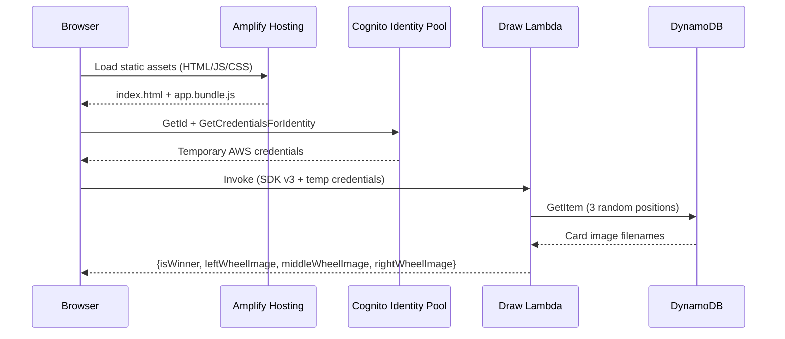

# Slot Machine 🎰

A demo application showcasing AWS serverless capabilities. Pull the handle and see if three cards match — all running on fully managed AWS services with zero servers to maintain.


## What This Demonstrates

This project is a reference implementation for building a serverless web application on AWS using modern tooling:

- **Compute without servers** — Lambda functions handle business logic on demand
- **NoSQL at scale** — DynamoDB stores data with single-digit millisecond reads
- **Zero-trust frontend auth** — Cognito provides temporary credentials without user sign-up
- **Static hosting done right** — Amplify Hosting serves assets over HTTPS with custom domains
- **Infrastructure as Code** — SAM template defines the entire stack declaratively
- **Local development** — Floci emulates AWS services locally for fast iteration

## Architecture



The frontend obtains temporary AWS credentials from Cognito (no sign-in required), invokes the Lambda function directly using AWS SDK v3, and displays the result. The Lambda reads 3 random positions from DynamoDB and determines if all three cards match (winner).

## Project Structure

```
├── backend/                      # AWS SAM infrastructure
│   ├── draw-lambda/              # Slot draw Lambda (nodejs22.x, SDK v3)
│   ├── seed-lambda/              # Seed data Lambda (CloudFormation custom resource)
│   │   ├── index.js             # Lambda handler
│   │   └── seed-records.js     # Shared seed data + write logic
│   ├── template.yaml            # SAM template
│   └── samconfig.toml            # SAM CLI config
├── frontend/                     # Browser app
│   ├── src/                      # JS source (SDK v3, esbuild)
│   ├── static/                   # HTML, CSS, images
│   └── deploy.ps1               # Build + deploy to Amplify
├── local/                        # Local development
│   ├── dev-server.js             # Express dev server
│   ├── seed-local.js             # Seeds local DynamoDB (reuses seed-records.js)
│   └── docker-compose.yml        # Floci (local AWS emulator)
├── .github/workflows/            # CI/CD pipeline
├── package.json                  # Root scripts
└── README.md
```

## Prerequisites

- [Docker](https://docs.docker.com/get-docker/) (with Docker Compose)
- [Node.js 22.x](https://nodejs.org/)
- [AWS SAM CLI](https://docs.aws.amazon.com/serverless-application-model/latest/developerguide/install-sam-cli.html)

## Local Development

Uses [Floci](https://github.com/floci-io/floci) — a free, open-source AWS emulator.

```bash
# Start Floci
docker compose -f local/docker-compose.yml up -d

# Install dependencies
npm install
cd frontend; npm install; cd ..

# Seed local DynamoDB
npm run seed-local

# Start dev server
npm run dev
```

Open http://localhost:3000

The dev server calls the Lambda handler function directly (no container overhead). DynamoDB operations go through Floci's emulated DynamoDB on port 4566.

### View Floci Logs

```bash
docker compose -f local/docker-compose.yml logs -f floci
```

### Stop

```bash
docker compose -f local/docker-compose.yml down
```

## Deployment

### Backend (SAM)

```bash
npm run deploy-backend
```

With custom domain:

```bash
cd backend
sam build
sam deploy --parameter-overrides "CustomDomain=your-domain.com"
```

Stack name and region are configured in `backend/samconfig.toml`:

```toml
[default.deploy.parameters]
stack_name = "slot-machine-stack"
region = "eu-west-1"
```

### Frontend (Amplify)

```bash
npm run deploy-frontend
```

Reads stack outputs, builds the SDK v3 bundle with esbuild, and deploys to Amplify Hosting.

### Destroy

```bash
cd backend
sam delete --region eu-west-1
```
